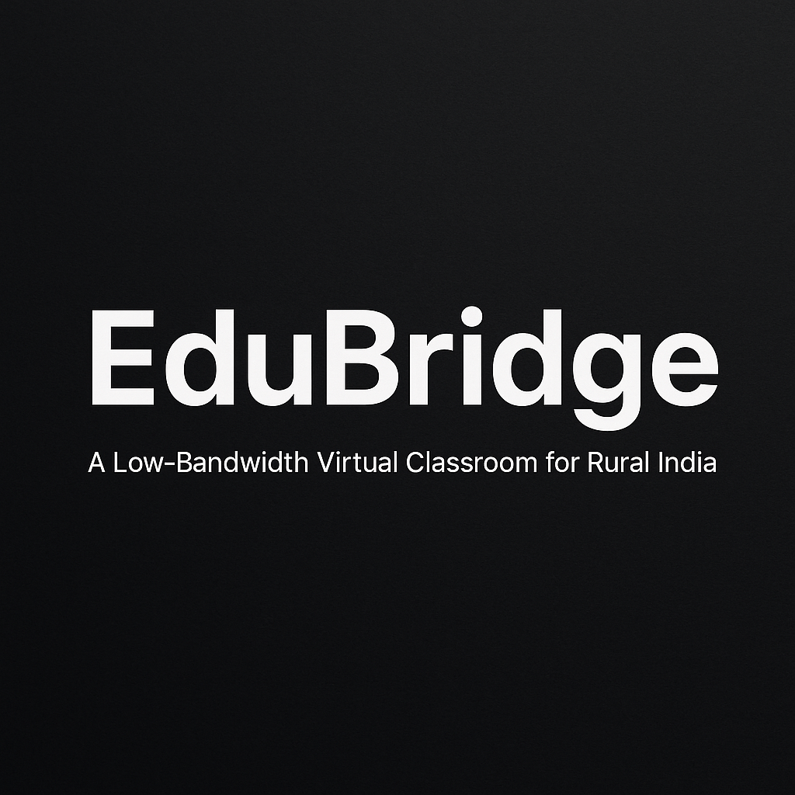

  

 

# 🧠 EduBridge  
### _A Low-Bandwidth Virtual Classroom Ecosystem for Rural Education_

# 🧠 EduBridge  
### _A Low-Bandwidth Virtual Classroom Ecosystem for Rural Education_

---

 

---

# 📁 IT1-A1
This repository contains all the resources and materials related to our **Community Engagement Project (CEP)** — *EduBridge*.

---

## 📚 Contents

1. 📊 All Review Presentations (Review 1 & Review 2)  
2. 🧾 Project Review Documentation  
3. 🎥 Demonstration Video with Voice Explanation  

---

## 🧭 Table of Contents

1. [Problem Statement](#-problem-statement)  
2. [Objectives](#-objectives)  
3. [Proposed Solution](#-proposed-solution)  
4. [Technology Stack](#-technology-stack)  
5. [Why MobileNetV2?](#-why-mobilenetv2)  
6. [Contributors](#-contributors)

---

## 🚩 Problem Statement

Rural diploma colleges often lack subject lecturers in advanced domains such as **Artificial Intelligence**, **VLSI**, and **Renewable Energy**.  
Students are left to depend on self-study or costly city-based coaching, widening the **urban-rural learning gap**.

Existing online education solutions fail due to **unstable, low-bandwidth connectivity** and the need for **complex infrastructure**.  
There is a critical need for a **lightweight, software-only virtual classroom ecosystem** that ensures:
- Clear audio and compressed visuals  
- Offline-accessible recordings  
- Interactive quizzes and discussion boards  
- Optimized performance for entry-level smartphones and minimal data usage  

The solution must be **simple for faculty**, **affordable for institutions**, and **sustainable in low-resource environments**.

---

## 🎯 Objectives

- Develop a **low-bandwidth optimized virtual classroom system**.  
- Ensure **audio-first delivery** with compressed visuals for clarity.  
- Provide both **live interaction** and **offline access** to lectures.  
- Enable **interactive features** (quizzes, polls, discussion boards).  
- Design a **mobile-friendly**, **simple**, and **cost-effective** solution.

---

## 💡 Proposed Solution

**EduBridge** is a **software-only virtual classroom platform** designed to deliver seamless learning experiences in low-connectivity environments.  
It enables **real-time interaction**, **recorded sessions**, and **AI-based engagement monitoring**, without requiring expensive hardware or high-speed internet.

---

## 🧰 Technology Stack

**Frontend:** React.js, Tailwind CSS, TypeScript  
**Backend:** Express.js  
**Database:** PostgreSQL  
**Machine Learning Framework:** TensorFlow + Keras (trained on Kaggle)

**Dataset Details:**
- Custom 2-class dataset: `Engagement` and `Disengagement`
- Total Images: 8000  
- Preprocessing: Resized to 224×224, pixel values rescaled to [0,1]  
- Split: 80% Training, 20% Validation  

**Models Tested:**  
- ✅ MobileNetV2 (Selected)  
- 🔵 ResNet50  
- 🔴 VGG16  

🔗 [Kaggle Notebook](https://www.kaggle.com/code/imgojo/face-engagement)  
🔗 [Keras Model Reference](https://keras.io/api/applications/)

---

## ⚙️ Why MobileNetV2?

- Designed for **low-compute, low-power environments**  
- Requires **less memory and processing time**  
- Offers **real-time performance** on entry-level devices  
- Ideal for **mobile and rural classroom deployments**

---

## 🧾 Project Summary

| Category | Details |
|-----------|----------|
| **Project Type** | Community Engagement Project (CEP) |
| **Institute** | Marathwada Mitra Mandal’s College of Engineering, Pune |
| **Department** | Information Technology |
| **Guide** | Mrs. S. P. Vanjari |
| **Academic Year** | 2025–26 |

---

## 👥 Contributors

| Name | Role | PRN |
|------|------|------|
| **Gaurav Jadhav** | Dataset Creation, ML Model Training, Research Documentation | SI154 |
| **Shreyash Mandlapure** | Frontend & Backend Development, Database Design, UI/UX Documentation | SI167 |

---

⭐ *If you found this project inspiring or helpful, don’t forget to star this repository!* ⭐

